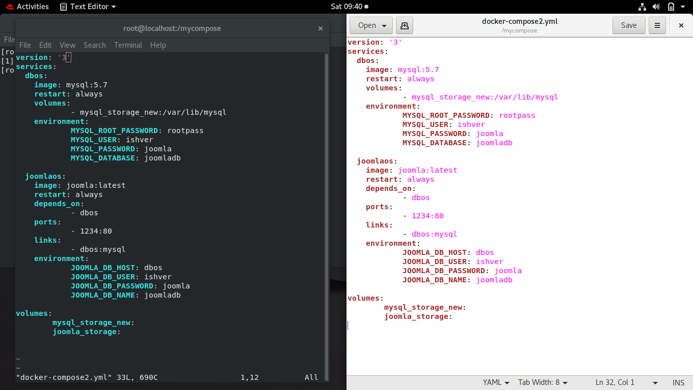

# Joomla_MYSQL-Database_Complete_Setup_Docker_Project_IIEC_RISE

Joomla is an open source Content Management System (CMS), which is used to build websites and online applications. It is free and extendable which is separated into front-end templates and back-end templates (administrator). Joomla is developed using PHP, Object Oriented Programming, software design patterns and MySQL (used for storing the data). This Docker_Compose file will provide you a complete environment in which you can create websites with backend support by a single command in less than one second.

Using this repository you can do these things automatically:-

    Download images from DockerHub Community. 
    Create Docker volumes for permanent storage of your data.
    Set Up MySQl Database for data storage.
    Set up Joomla framework for creating websites.

## This Compose file build on these technologies:
* Redhat Enterprise Linux Version 8
* Docker
* Joomla 
* MYSQL

# Pre-requisites for Installations
First of all install Redhat_Enterprise_Linux_Version_8 and configure yum properly make sure you have installed the latest, stable and compatible versions of Docker, Joomla, MYSQL server, Docker Compose.

# If you dont have go this way:

* Docker install on Redhat8:

Configure yum by adding docker.repo:

    $ cd /etc/yum.repos.d 
    $ gedit docker.repo
        here add these lines:
        
        [docker_repo]
        name=docker_repo
        baseurl=https://download.docker.com/linux/centos/docker-ce.repo
        gpgcheck=0
        
        save it.
    $ yum install docker-ce --nobest

# Start Docker:
    
    $ sudo systemctl start docker

# Now install Docker Compose:-
    
    $ sudo curl -L https://github.com/docker/compose/releases/download/1.21.2/docker-compose-`uname -s`-`uname -m` -o /usr/local/bin/docker-compose
    
    $ sudo chmod +x /usr/local/bin/docker-compose

## For downloading the Images go to https://hub.docker.com

Download the Joomla image:
    
    $ docker pull joomla:latest

Download the MySQL image:

    $ docker pull mysql:5.7 

# For Setup:
## Mysql Server:
    
    $ docker run -dit -e MYSQL_ROOT_PASSWORD=rootpass  -e MYSQL_USER=username -e MYSQL_PASSWORD=password  -e MYSQL_DATABASE=mydb -v mysql_storage:/var/lib/mysql --name dbos mysql:5.7
    
## Mysql Client:
    
    $ mysql -h serverIP -u username -p(your_password)
    

## Joomla Server:
    
    $ docker run -dit -e JOOMLA_DB_HOST=dbos  -e JOOMLA_DB_USER=ishver  -e JOOMLA_DB_PASSWORD=joomla -e JOOMLA_DB_NAME=joomladb  -v joomla_storage:/var/lib/mysql  -p 1234:80 --link dbos --name joomos joomla:latest

# Docker-Compose

Install a docker-compose software from https://docs.docker.com/compose/install. Make a compose file using:-
    
    $ mkdir mycompose. 

You can create/edit your docker-compose file using

    $ vim docker-compose.yml

Here in this **docker-compose.yml** file  edit the **joomla_server** and **MySQL server** command in yaml format likes this:-
    

    
